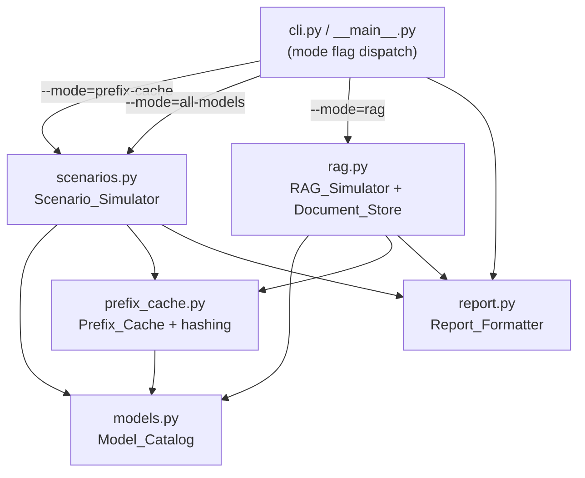

# Design Document

## Overview

`python-llm-rag-simulation` is a CLI-only Python port of the existing Go module in
`internal/llm/`. It analytically computes transformer attention FLOP costs and simulates
an in-memory prefix/KV cache to quantify the compute and dollar savings that prefix caching
produces for LLM inference and RAG pipelines. It runs **no real models and performs no real
inference** — every number is produced by closed-form FLOP arithmetic plus a simulated cache.

The module lives in a `python/` subdirectory of the distributed-caching repository and is
invoked as a Python module: `python -m llmsim --mode=...`. It supports three modes:

1. **prefix-cache scenarios** (default) — five pre-built business scenarios.
2. **all-models comparison** — one workload run across all six models.
3. **RAG simulation** — a retrieve-then-read RAG pipeline with Zipf document popularity and a
   monthly cost projection.

### Goals

- **Numerical parity with Go** for the deterministic analytic math: attention FLOPs, TFLOPs,
  H100 dollar cost, and KV-cache-size-per-token match the Go formulas within a relative
  tolerance of `1e-9` (Requirements 2.5, 7.3).
- **Determinism** via a seeded RNG (seed `42`, matching the Go version) so scenario and RAG
  results reproduce across runs and process invocations (Requirements 6.11, 7.5, 10.10).
- **Legitimate NumPy usage** where it is natural: vectorized per-model cost arrays for the
  all-models comparison, FLOP/cost computation, and Zipf sampling via
  `numpy.random.Generator.zipf`. Plain Python is used where it is clearer (the LRU cache,
  hashing, report formatting).
- **Modern idiomatic Python**: dataclasses for all records, type hints throughout, a clean
  package layout, and a `pyproject.toml` declaring `numpy` and `pytest`.

### Reference behavior note (Zipf)

The deterministic analytic cost math (FLOPs/TFLOPs/USD/KV-bytes) is reproduced **exactly** from
Go. Document popularity sampling differs: Go uses `math/rand.NewZipf`, while this port uses
`numpy.random.Generator.zipf` per the design constraints. Both are deterministic under a fixed
seed, but the two generators are not byte-identical, so the headline RAG result (~92.3% compute
reduction on a 1,000-request pipeline) is **reproduced approximately**, not bit-for-bit. The
cost-per-prefix, savings arithmetic, and projection math are identical to Go given the same hit
counts.

## Architecture

The system is a layered, dependency-light CLI. The CLI layer parses a mode flag and dispatches
to a simulator. Simulators drive the `Prefix_Cache` and `Model_Catalog` and hand results to the
`Report_Formatter` for stdout rendering. There is no web server and no network listener
(Requirement 12.6).



### Package / file layout

```
python/
├── pyproject.toml              # declares numpy + pytest, package metadata, entry point
├── README.md
└── src/
    └── llmsim/
        ├── __init__.py         # package exports
        ├── __main__.py         # enables `python -m llmsim`
        ├── models.py           # Model_Catalog: ModelConfig, FLOP/cost math, NumPy vectorization
        ├── prefix_cache.py     # Prefix_Cache: CacheEntry, LRU cache, hashing, CacheStats
        ├── scenarios.py        # Scenario_Simulator: scenarios + all-models comparison
        ├── rag.py              # RAG_Simulator: Document_Store, RAGConfig, RAG pipeline
        ├── report.py           # Report_Formatter: money/int/percent/TFLOPs + renderers
        └── cli.py              # argument parsing + mode dispatch + exit codes
    └── tests/
        ├── test_models.py      # FLOP/TFLOPs/KV/cost math, NumPy parity, boundaries
        ├── test_prefix_cache.py# hashing, hit/miss, LRU eviction, stats
        ├── test_scenarios.py   # scenario savings math, determinism, all-models comparison
        ├── test_rag.py         # exact-set matching, RAG savings, projection, range clamp
        └── test_cli.py         # mode dispatch + exit codes
```

The `src/` layout keeps the importable package isolated; `pyproject.toml` lets `pytest` discover
`tests/` and lets `python -m llmsim` resolve the package when installed in editable mode.

## Components and Interfaces

All records are `@dataclass` types with full type hints. Function signatures below are the
public contract; private helpers are prefixed with `_`.

### Model_Catalog (`models.py`)

```python
MAX_SEQ_LEN: int = 1_048_576          # 2**20, inclusive upper bound (Req 2.1, 2.7)
H100_TFLOPS_PER_SEC: float = 312.0
H100_HOURLY_COST_USD: float = 2.50

@dataclass(frozen=True)
class ModelConfig:
    name: str
    num_layers: int
    num_kv_heads: int
    num_q_heads: int
    head_dim: int
    max_context_len: int
    params_billion: float

    def attention_flops(self, seq_len: int) -> float: ...
        # validates seq_len; returns num_layers * (4 * num_q_heads * head_dim * seq_len**2)
    def attention_tflops(self, seq_len: int) -> float: ...   # attention_flops / 1e12
    def cost_usd(self, seq_len: int) -> float: ...           # tflops / 312 / 3600 * 2.50
    def kv_cache_size_per_token(self) -> int: ...            # 2 * num_kv_heads * head_dim * 2 * num_layers

# Six module-level configs (frozen):
LLAMA3_8B, LLAMA3_70B, MISTRAL_7B, MIXTRAL_8X7B, QWEN2_5_72B, DEEPSEEK_R1: ModelConfig

ALL_MODELS: tuple[ModelConfig, ...]   # ordered: 8B, 70B, Mistral, Mixtral, Qwen, DeepSeek (Req 1.8)

class UnknownModelError(ValueError): ...
class SeqLenRangeError(ValueError): ...

def get_model(name: str) -> ModelConfig: ...    # raises UnknownModelError on miss (Req 1.9, 1.10)
def validate_seq_len(seq_len: int) -> None: ...  # raises SeqLenRangeError (Req 2.7)

# NumPy vectorized helpers (Req 2.5, 7.3) — operate over ALL_MODELS or any model sequence:
def attention_tflops_vec(models: Sequence[ModelConfig], seq_len: int) -> np.ndarray: ...
def cost_usd_vec(models: Sequence[ModelConfig], seq_len: int) -> np.ndarray: ...
```

`attention_flops` validates `seq_len` first: it must be an `int` (a `bool` is rejected since
`bool` is an `int` subclass), `>= 0`, and `<= MAX_SEQ_LEN`. A `seq_len` of `0` yields `0.0`
FLOPs/TFLOPs/USD (Req 2.6). Out-of-range or non-integer input raises `SeqLenRangeError` and
computes nothing (Req 2.7).

### Prefix_Cache (`prefix_cache.py`)

```python
@dataclass
class CacheEntry:                      # Cache_Entry
    prefix_hash: str
    model: str
    token_count: int
    tflops_cost: float
    cost_usd: float
    hit_count: int = 0

    def saved_tflops(self) -> float:   # tflops_cost * hit_count (Req 5.5)
    def saved_usd(self) -> float:      # cost_usd * hit_count

@dataclass(frozen=True)
class CacheStats:                      # Cache_Stats
    total_requests: int
    cache_hits: int
    cache_misses: int
    hit_rate: float                    # percentage 0..100 (Req 5.2)
    entries_stored: int
    total_saved_tflops: float
    total_saved_usd: float

def hash_prefix(tokens: Sequence[int]) -> str: ...
    # SHA-256 of canonical JSON of tokens; returns first 16 bytes as 32 lowercase hex chars (Req 3)

class PrefixCache:
    def __init__(self, capacity: int) -> None: ...   # capacity >= 1 else ValueError (Req 4.8)
    def lookup(self, prefix_hash: str) -> CacheEntry | None: ...  # Req 4.1–4.4
    def store(self, entry: CacheEntry) -> None: ...               # Req 4.5–4.7, 4.9
    def stats(self) -> CacheStats: ...                            # Req 5.1–5.4

def new_entry_for_prefix(tokens: Sequence[int], model: ModelConfig) -> CacheEntry: ...
def format_tflops(tflops: float) -> str: ...   # PFLOPs/TFLOPs formatting (Req 13.4–13.6)
```

**Hashing** mirrors Go: serialize the token list to compact JSON (`json.dumps(tokens,
separators=(",", ":"))`, matching Go's `json.Marshal` byte layout), take `sha256(...).digest()`,
and hex-encode the first 16 bytes → exactly 32 lowercase hex characters. An empty list hashes
`[]` without error (Req 3.4). Identical token order/values → identical hash; any difference in
length, value, or order → different hash (Req 3.1–3.3).

**LRU** is implemented with `collections.OrderedDict[str, CacheEntry]` keyed by prefix hash
(Req 4.7), giving exact recency semantics without timestamp scanning:

- `lookup` increments `total_requests` (Req 4.4). On hit: `move_to_end(hash)` to mark most
  recently accessed, increment `hit_count`, increment `cache_hits`, add `tflops_cost` to
  `total_saved_tflops` and `cost_usd` to `total_saved_usd`, return the entry (Req 4.1, 4.3). On
  miss: return `None`, leaving stored entries and ordering unchanged (Req 4.2).
- `store`: if the hash already exists, replace the entry and `move_to_end` (entries-stored count
  unchanged, Req 4.9). Otherwise, if `len == capacity`, evict the least-recently-used entry via
  `popitem(last=False)` before inserting (Req 4.6); then insert at the end as most recent
  (Req 4.5).
- `stats`: `hit_rate = cache_hits / total_requests * 100` when `total_requests > 0`, else `0.0`
  with zero savings (Req 5.2, 5.3); `cache_misses = total_requests - cache_hits` (Req 5.4);
  `entries_stored = len(entries)` after any eviction (Req 5.1).

### Scenario_Simulator (`scenarios.py`)

```python
SEED: int = 42

@dataclass(frozen=True)
class Scenario:
    name: str
    description: str
    company: str
    system_prompt_len: int     # 1..1_000_000 tokens
    user_message_len: int      # 1..1_000_000 tokens
    num_requests: int          # 1..10_000_000
    prefix_reuse_rate: float   # 0.0..1.0
    model: ModelConfig

@dataclass(frozen=True)
class ScenarioResult:
    scenario: Scenario
    stats: CacheStats
    without_cache_cost: float
    with_cache_cost: float
    savings_usd: float
    savings_pct: float

class UnknownScenarioError(ValueError): ...
class ComparisonParamError(ValueError): ...

def default_scenarios() -> list[Scenario]: ...     # exactly 5 (Req 6.1)
def get_scenario(name: str) -> Scenario: ...        # raises UnknownScenarioError (Req 6.12)
def run_scenario(scenario: Scenario, *, seed: int = SEED) -> ScenarioResult: ...   # Req 6.3–6.11
def run_all_models_comparison(
    prefix_len: int, num_requests: int, reuse_rate: float, *, seed: int = SEED
) -> list[ScenarioResult]: ...                      # Req 7.1–7.5
```

`run_scenario` mirrors the Go flow: build a shared prefix of `system_prompt_len` sequential
token IDs, pre-populate the cache with it (Req 6.3), then for each request draw
`rng.random() < prefix_reuse_rate` to decide shared-vs-unique prefix (Req 6.4); on a miss, store
a new entry (Req 6.5). Cost math: `prefix_cost = model.cost_usd(system_prompt_len)`;
`without_cache = prefix_cost * num_requests` (Req 6.6); `with_cache = prefix_cost *
cache_misses` (Req 6.7); `savings_usd = without_cache - with_cache` (Req 6.8); `savings_pct =
savings_usd / without_cache * 100` when `without_cache > 0` else `0.0` (Req 6.9, 6.10). A fresh
seeded `numpy.random.Generator` per run guarantees identical miss counts and costs across runs
(Req 6.11).

`run_all_models_comparison` validates parameters first (Req 7.4): `prefix_len >= 1`,
`num_requests >= 1`, `0.0 <= reuse_rate <= 1.0`; on violation raises `ComparisonParamError`
naming the offending parameter and runs nothing. It then runs the identical workload against
each model in `ALL_MODELS`, producing one result per model in catalog order (Req 7.1, 7.2). The
per-model cost array is computed with NumPy (`cost_usd_vec`) and asserted equal to the scalar
path within `1e-9` (Req 7.3).

### RAG_Simulator and Document_Store (`rag.py`)

```python
@dataclass(frozen=True)
class Document:
    id: str
    token_count: int

class DocumentStoreParamError(ValueError): ...

class DocumentStore:                                   # Document_Store
    def __init__(self, num_docs: int, tokens_per_doc: int) -> None: ...  # Req 8.1, 8.5
    @property
    def num_docs(self) -> int: ...
    def retrieve(self, doc_indices: Sequence[int]) -> list[Document]: ... # Req 8.2, 8.3, 8.6

@dataclass(frozen=True)
class RAGConfig:
    model: ModelConfig
    num_documents: int      # 1..1_000_000
    tokens_per_doc: int     # 1..1_000_000
    top_k: int              # 1..num_documents
    query_tokens: int       # 0..1_000_000
    num_requests: int       # 1..10_000_000
    zipf_exponent: float    # > 0.0
    requests_per_day: int   # 1..1_000_000_000
    def validate(self) -> None: ...     # raises RAGConfigError naming bad field (Req 10.2)

class RAGConfigError(ValueError): ...

@dataclass(frozen=True)
class RAGResult:
    config: RAGConfig
    stats: CacheStats
    prefix_tokens: int
    cost_per_miss_usd: float
    without_cache_usd: float
    with_cache_usd: float
    savings_usd: float
    savings_pct: float
    per_req_without_usd: float
    per_req_with_usd: float
    monthly_requests: int
    monthly_without: float
    monthly_with: float
    monthly_savings: float

def default_rag_config() -> RAGConfig: ...
def run_rag_simulation(cfg: RAGConfig, *, seed: int = SEED) -> RAGResult: ...   # Req 10, 11
def build_prefix_tokens(doc_indices: Sequence[int], query_tokens: int) -> list[int]: ...  # Req 9.4, 9.5
def new_entry_for_token_count(prefix_hash: str, token_count: int, model: ModelConfig) -> CacheEntry: ...
```

`run_rag_simulation` validates the config (Req 10.2), builds a `DocumentStore`, and a
`PrefixCache(100_000)`. `prefix_tokens = top_k * tokens_per_doc + query_tokens` (Req 10.4). Per
request it samples `top_k` document indices from `numpy.random.Generator.zipf(zipf_exponent + 1)`
(the `+1` mirrors Go's `s = exponent + 1` shaping), maps each sample into the valid range
`[0, num_documents - 1]`, retrieves, builds the prefix, hashes, and looks up; on miss it stores
an entry whose cost reflects the full `prefix_tokens` and increments misses (Req 10.5, 10.6).
Cost and projection math follow Go exactly (Req 10.7–10.9, 11).

**Zipf range mapping (Req 10.11):** `numpy.random.Generator.zipf(a)` returns values `>= 1` and
is unbounded above. To keep selected indices within `[0, num_documents - 1]` while preserving
the head-heavy skew, the simulator draws a batch, converts to 0-based (`value - 1`), and applies
**rejection** (discarding samples `>= num_documents` and redrawing) rather than modulo, since
modulo would fold the long tail back onto the head and distort popularity. Sampling is done in
vectorized batches from a single seeded `Generator` for determinism (Req 10.10) and speed.

**Exact-set matching (Req 9):** before building the prefix, the simulator removes duplicate
indices and sorts ascending (Req 9.1), so `{3,1,2}` and `{1,2,3}` yield identical prefixes and
hashes (Req 9.2); different unique sets yield different prefixes (Req 9.3).
`build_prefix_tokens` encodes each retrieved doc as 8 marker tokens (`500000 + idx`) in ascending
order, then appends a fixed query block of `query_tokens` tokens (`900000 + j`) (Req 9.4); with
no indices selected the prefix is the query block only (Req 9.5).

### Report_Formatter (`report.py`)

```python
def format_money(value: float) -> str: ...      # "1,234.56" — comma thousands, 2 decimals (Req 13.1)
def format_int(value: int) -> str: ...           # "1,000,000" — comma thousands, 0 decimals (Req 13.2)
def format_percent(value: float) -> str: ...     # "92.3" — 1 decimal (Req 13.3)
def format_tflops(value: float) -> str: ...      # PFLOPs/TFLOPs tiers (Req 13.4–13.6)
def render_scenario_result(result: ScenarioResult) -> str: ...
def render_model_comparison(results: list[ScenarioResult]) -> str: ...   # one row per model (Req 13.8)
def render_rag_result(result: RAGResult) -> str: ...                      # full RAG report (Req 13.7)
```

Money/int formatting uses Python format specs (`f"{value:,.2f}"`, `f"{value:,d}"`); `format_tflops`
reproduces the Go tiers: `>= 1000` → PFLOPs with 1 decimal, `>= 1` → TFLOPs with 2 decimals,
`< 1` → TFLOPs with 4 decimals. Renderers return strings (testable) that the CLI prints.

### CLI (`cli.py`, `__main__.py`)

```python
VALID_MODES = {"prefix-cache", "all-models", "rag"}   # case-sensitive (Req 12.2)
DEFAULT_MODE = "prefix-cache"

def build_parser() -> argparse.ArgumentParser: ...
def main(argv: list[str] | None = None) -> int: ...   # returns exit code (Req 12.3–12.5)
```

`main` parses `--mode` (default `prefix-cache`). An unrecognized mode prints an error listing the
three valid values and returns a non-zero exit code without running a simulation (Req 12.4). A
valid mode runs the corresponding simulator, prints the rendered report to stdout, and returns
`0` (Req 12.3, 12.5). `__main__.py` calls `sys.exit(main(sys.argv[1:]))`, enabling
`python -m llmsim`. No sockets/servers are opened (Req 12.6).

## Data Models

| Dataclass | Source component | Key fields | Maps to |
|-----------|------------------|------------|---------|
| `ModelConfig` (frozen) | Model_Catalog | name, num_layers, num_kv_heads, num_q_heads, head_dim, max_context_len, params_billion | Req 1.1–1.8 |
| `CacheEntry` | Prefix_Cache | prefix_hash, model, token_count, tflops_cost, cost_usd, hit_count | Req 4, 5.5 |
| `CacheStats` (frozen) | Prefix_Cache | total_requests, cache_hits, cache_misses, hit_rate, entries_stored, total_saved_tflops, total_saved_usd | Req 5.1–5.4 |
| `Scenario` (frozen) | Scenario_Simulator | name, description, company, system_prompt_len, user_message_len, num_requests, prefix_reuse_rate, model | Req 6.1, 6.2 |
| `ScenarioResult` (frozen) | Scenario_Simulator | scenario, stats, without_cache_cost, with_cache_cost, savings_usd, savings_pct | Req 6.6–6.10, 7.2 |
| `Document` (frozen) | Document_Store | id, token_count | Req 8.1 |
| `RAGConfig` (frozen) | RAG_Simulator | model, num_documents, tokens_per_doc, top_k, query_tokens, num_requests, zipf_exponent, requests_per_day | Req 10.1 |
| `RAGResult` (frozen) | RAG_Simulator | stats, prefix_tokens, cost_per_miss_usd, without/with/savings, per-req averages, monthly projection | Req 10.7–11.6 |

### Token-ID model

Token sequences are `list[int]` of synthetic IDs (no real tokenizer). Scenario shared prefixes
use `1000 + i`; unique prefixes use random IDs in `[200000, 300000)`; RAG doc markers use
`500000 + idx`; query blocks use `900000 + j`. These offsets keep token-space regions disjoint so
distinct prefixes hash differently, exactly as in Go.

## NumPy Vectorization Approach

NumPy is used where it is genuinely the right tool, and avoided where a plain loop is clearer.

1. **Vectorized per-model cost (all-models comparison, Req 7.3).**
   `cost_usd_vec(ALL_MODELS, seq_len)` builds NumPy arrays of `num_layers`, `num_q_heads`, and
   `head_dim` and computes all six costs in one expression:
   `flops = num_layers * (4.0 * num_q_heads * head_dim * seq_len**2)`,
   `tflops = flops / 1e12`, `usd = tflops / 312.0 / 3600.0 * 2.50`.
   The result is asserted equal to the scalar `ModelConfig.cost_usd` path within `rtol=1e-9` via
   `np.allclose` (Req 2.5, 7.3). `seq_len**2` uses Python `float` then NumPy `float64`; because
   the per-model values fit comfortably in `float64`, parity holds well within tolerance.

2. **FLOP/cost computation.** The scalar formulas use plain Python floats (exact parity with Go's
   `float64`). The vectorized variant exists specifically for the multi-model comparison and as
   the subject of the parity property.

3. **Zipf sampling (Req 10.3, 10.11).** `numpy.random.Generator.zipf(a, size=batch)` from a
   seeded `np.random.default_rng(seed)` generates document popularity draws. Vectorized batch
   sampling plus rejection-into-range keeps the hot-document skew and runs fast for large request
   counts.

Plain Python (no NumPy) is used for: SHA-256 hashing, the `OrderedDict` LRU cache, scenario
reuse-rate Bernoulli draws (`rng.random()`), and all report formatting — these are clearer and
not numerically vectorizable in a meaningful way.

## Error Handling

| Condition | Handling | Requirement |
|-----------|----------|-------------|
| `get_model` with unknown name | raise `UnknownModelError` listing valid names; return nothing | 1.10 |
| `seq_len` negative, non-int, or `> 1_048_576` | raise `SeqLenRangeError`; compute no values | 2.7 |
| `seq_len == 0` | return `0.0` FLOPs/TFLOPs/USD (not an error) | 2.6 |
| `PrefixCache(capacity < 1)` | raise `ValueError` | 4.8 |
| `get_scenario` unknown identifier | raise `UnknownScenarioError`; run no simulation | 6.12 |
| all-models comparison: `prefix_len < 1` / `num_requests < 1` / `reuse_rate` out of `[0,1]` | raise `ComparisonParamError` naming the field; run nothing | 7.4 |
| `DocumentStore` `num_docs < 1` or `tokens_per_doc < 1` | raise `DocumentStoreParamError` naming the field; create no store | 8.5 |
| retrieve index `< 0` or `>= num_docs` | silently exclude that index; return remaining in-range docs | 8.3, 8.6 |
| `RAGConfig` field out of range or `top_k > num_documents` | raise `RAGConfigError` naming the field; run no simulation | 10.2 |
| division by zero in savings/projection (`without_cache == 0` or `num_requests == 0`) | report `0.0` without dividing | 6.10, 10.9, 11.2 |
| CLI unrecognized `--mode` | print error + the three valid modes; return non-zero exit code | 12.4 |

All validation raises **before** any simulation work, so rejected inputs produce no partial
results. Custom exception types subclass `ValueError` so callers can catch broadly or specifically.


## Correctness Properties

*A property is a characteristic or behavior that should hold true across all valid executions of a
system — essentially, a formal statement about what the system should do. Properties serve as the
bridge between human-readable specifications and machine-verifiable correctness guarantees.*

The properties below are derived from the prework analysis. Redundant criteria were consolidated:
the three determinism criteria (6.11, 7.5, 10.10) become one property; the two NumPy-parity
criteria (2.5, 7.3) become one; the identical savings arithmetic in the scenario and RAG
simulators (6.6–6.10, 10.7–10.9) becomes one; and several cache criteria are combined into hit,
store, accounting, and structural invariants.

### Property 1: Analytic attention and cost math match the reference formulas

*For any* model configuration and *any* integer sequence length in `[0, 1_048_576]`,
`attention_flops` equals `num_layers × (4 × num_q_heads × head_dim × seq_len²)`,
`attention_tflops` equals that value `/ 1e12`, `cost_usd` equals `attention_tflops / 312 / 3600 ×
2.50`, and `kv_cache_size_per_token` equals `2 × num_kv_heads × head_dim × 2 × num_layers`; at
`seq_len = 0` the FLOPs, TFLOPs, and USD values are all `0.0`.

**Validates: Requirements 2.1, 2.2, 2.3, 2.4, 2.6**

### Property 2: NumPy vectorized cost equals the scalar cost within tolerance

*For any* integer sequence length in `[0, 1_048_576]`, the NumPy vectorized per-model cost array
(`cost_usd_vec(ALL_MODELS, seq_len)`, and likewise `attention_tflops_vec`) is element-wise equal
to the scalar per-model computation within a relative tolerance of `1e-9`.

**Validates: Requirements 2.5, 7.3**

### Property 3: Sequence-length validation rejects out-of-range and non-integer inputs

*For any* value that is a negative integer, an integer greater than `1_048_576`, or a non-integer,
the FLOP/TFLOP/cost functions raise `SeqLenRangeError` and compute no values.

**Validates: Requirements 2.7**

### Property 4: Unknown model and scenario lookups raise errors

*For any* string that is not one of the six model names, `get_model` raises `UnknownModelError`;
*for any* string that is not one of the five scenario identifiers, `get_scenario` raises
`UnknownScenarioError` and runs no simulation.

**Validates: Requirements 1.10, 6.12**

### Property 5: Prefix hash is a stable 32-character lowercase hex string

*For any* token sequence (including the empty sequence), `hash_prefix` returns a string matching
`^[0-9a-f]{32}$`, and repeated invocations on the same token values (in the same order) return the
identical string.

**Validates: Requirements 3.1, 3.2, 3.4**

### Property 6: Prefix hashing distinguishes different sequences

*For any* two token sequences that differ in length, in any token value, or in token ordering, the
two hash strings differ.

**Validates: Requirements 3.3**

### Property 7: Cache hit returns the entry, marks it most-recently-used, and accumulates savings

*For any* cache containing an entry, looking up that entry's hash returns the entry, increments its
`hit_count` by one, marks it as the most-recently-used entry, increments `cache_hits`, and adds the
entry's `tflops_cost` and `cost_usd` to the running saved totals.

**Validates: Requirements 4.1, 4.3**

### Property 8: Cache miss returns nothing and leaves the cache unchanged

*For any* cache and *any* hash absent from it, lookup returns `None` and leaves the set of stored
entries and their recency ordering unchanged.

**Validates: Requirements 4.2**

### Property 9: Store inserts or replaces, keeping at most one entry per hash

*For any* cache below capacity, storing a new hash adds the entry as most-recently-used and grows
`entries_stored` by one without evicting; storing a hash already present replaces that entry, marks
it most-recently-used, and leaves `entries_stored` unchanged; at all times at most one entry exists
per distinct prefix hash.

**Validates: Requirements 4.5, 4.7, 4.9**

### Property 10: Storing at full capacity evicts exactly the least-recently-used entry

*For any* access pattern that fills the cache to capacity, storing a new distinct hash evicts
exactly one entry — the least recently used (by most recent lookup or store) — before inserting the
new entry as most-recently-used.

**Validates: Requirements 4.6**

### Property 11: Cache accounting is consistent

*For any* sequence of lookups, `total_requests` equals the number of lookups, `cache_hits +
cache_misses == total_requests`, and when `total_requests > 0` the `hit_rate` equals `cache_hits /
total_requests × 100` and lies in `[0, 100]`.

**Validates: Requirements 4.4, 5.2, 5.4**

### Property 12: Entry saved totals scale with hit count

*For any* cache entry and *any* hit count, `saved_tflops == tflops_cost × hit_count` and `saved_usd
== cost_usd × hit_count`, both `0.0` when `hit_count` is `0`.

**Validates: Requirements 5.5**

### Property 13: Savings arithmetic relationships hold for both simulators

*For any* per-unit prefix cost, total request count, and cache-miss count, `without_cache == cost ×
requests`, `with_cache == cost × misses`, `savings == without_cache − with_cache`, and
`savings_pct == savings / without_cache × 100` when `without_cache > 0`, otherwise `savings_pct ==
0.0` (computed without dividing). This relationship governs both scenario results and RAG results.

**Validates: Requirements 6.6, 6.7, 6.8, 6.9, 6.10, 10.7, 10.8, 10.9**

### Property 14: Seeded simulations are deterministic

*For any* scenario, all-models comparison, or RAG configuration, running it twice with the same
fixed seed produces identical cache-miss counts, hit rates, cost values, and savings values.

**Validates: Requirements 6.11, 7.5, 10.10**

### Property 15: All-models comparison produces one ordered, well-formed result per model

*For any* valid prefix length, request count, and reuse rate, the comparison returns exactly six
results ordered to match `ALL_MODELS`, each containing a hit rate in `[0, 100]`, a per-prefix cost,
total TFLOPs saved, and a savings percentage in `[0, 100]`.

**Validates: Requirements 7.1, 7.2**

### Property 16: Comparison parameter validation rejects invalid inputs

*For any* prefix length `< 1`, request count `< 1`, or reuse rate outside `[0.0, 1.0]`, the
all-models comparison raises `ComparisonParamError` naming the invalid parameter and produces no
results.

**Validates: Requirements 7.4**

### Property 17: Document store construction and retrieval are well-behaved

*For any* valid document count and tokens-per-document, the store holds exactly that many documents
each with the given token count, and valid indices are `0 … count−1`; retrieval returns exactly one
document for each in-range requested index, silently excludes out-of-range indices, and returns an
empty list when no requested index is in range — never raising an error.

**Validates: Requirements 8.1, 8.2, 8.3, 8.6**

### Property 18: Document store rejects invalid construction parameters

*For any* document count `< 1` or tokens-per-document `< 1`, construction raises
`DocumentStoreParamError` naming the invalid parameter and creates no store.

**Validates: Requirements 8.5**

### Property 19: Exact-set prefix matching is order- and duplicate-independent

*For any* multiset of document indices, building the prefix after de-duplicating and sorting yields
the same prefix hash for every permutation and duplication of the same underlying unique index set.

**Validates: Requirements 9.1, 9.2**

### Property 20: Different unique index sets produce different prefix hashes

*For any* two different sets of unique document indices, the resulting prefixes differ in content
and therefore produce different prefix hashes.

**Validates: Requirements 9.3**

### Property 21: RAG configuration validation rejects invalid fields

*For any* RAG configuration with a single field outside its accepted range — including `top_k >
num_documents` — `validate` raises `RAGConfigError` naming the invalid field and runs no
simulation.

**Validates: Requirements 10.2**

### Property 22: RAG prefix size and cache accounting are consistent

*For any* valid RAG configuration, `prefix_tokens == top_k × tokens_per_doc + query_tokens`, the
number of cache misses equals the number of stored entries created, and `cache_hits + cache_misses
== num_requests`.

**Validates: Requirements 10.4, 10.5, 10.6**

### Property 23: Zipf-selected document indices stay within range

*For any* valid RAG configuration, every document index selected for retrieval lies within
`[0, num_documents − 1]`.

**Validates: Requirements 10.11**

### Property 24: Monthly projection arithmetic holds

*For any* RAG run with request count `> 0`, the per-request averages equal the corresponding totals
divided by the request count; `monthly_requests == requests_per_day × 30`; `monthly_without ==
per_req_without × monthly_requests`; `monthly_with == per_req_with × monthly_requests`; and
`monthly_savings == monthly_without − monthly_with`.

**Validates: Requirements 11.1, 11.3, 11.4, 11.5, 11.6**

## Testing Strategy

Property-based testing **is** appropriate for this feature: the core is pure analytic math
(FLOPs/cost), deterministic hashing, a cache with universal invariants, exact-set matching, and
closed-form savings/projection arithmetic — all with large input spaces and clear "for all"
statements. UI rendering and CLI dispatch are the only example-based areas.

### Dual approach

- **Property tests** verify the 24 universal properties above across generated inputs.
- **Unit/example tests** cover the fixed catalogs (6 models, 5 scenarios), report formatting, CLI
  dispatch and exit codes, and the specific boundary cases flagged as EDGE_CASE in the prework
  (seq_len 0, empty token sequence, empty/all-out-of-range retrieval, capacity `< 1`, zero-request
  projection, reuse-rate `0.0`/`1.0`, `format_tflops` tier boundaries).

### Tooling and configuration

- **Test runner:** `pytest` (Requirement 14). Failures are reported with the count and identity of
  failing tests and a non-zero exit status (Requirements 14.5, 14.6) — `pytest`'s default behavior.
- **Property library:** **Hypothesis** (the standard Python PBT library) — not hand-rolled.
  Strategies: `st.integers(0, 1_048_576)` for sequence lengths, `st.lists(st.integers())` for token
  sequences (including the empty list), `st.sampled_from(ALL_MODELS)` for models,
  `st.integers(min_value=0)` for document indices, and composite strategies for cache access
  patterns and RAG configs.
- **Iterations:** each property test runs a **minimum of 100 iterations** (Hypothesis
  `max_examples=100` or more).
- **Tagging:** each property test carries a comment in the form
  **`Feature: python-llm-rag-simulation, Property {number}: {property_text}`** referencing the
  design property it implements, with exactly one property-based test per property.
- **Determinism in tests:** simulator property tests pass an explicit `seed` so runs are
  reproducible; Property 14 specifically asserts equality across two seeded runs.
- **NumPy parity:** Property 2 uses `np.allclose(vectorized, scalar, rtol=1e-9)`.

### Reference / example tests (mirroring the ~17 Go tests)

The Go module's test surface is reproduced as targeted unit tests, complementing the property
tests:

1. FLOP/TFLOPs/KV/cost math for a known model and sequence length, including the `seq_len = 0`
   boundary (Req 14.1).
2. Cache hit returns the matching entry and records a hit; cache miss returns nothing and records a
   miss; LRU eviction removes the least-recently-used entry at full capacity (Req 14.2).
3. Retrieved-document-set equality by order-independent set equality, including the empty-set and
   full-overlap boundaries (Req 14.3).
4. Savings math and monthly projection math against expected reference values within `1e-9`,
   including the zero-cost-without-cache boundary where savings percentage is `0.0` (Req 14.4).
5. CLI smoke tests: default mode returns exit code `0`, each valid mode returns `0`, an unknown
   mode returns a non-zero exit code and prints the three valid modes (Req 12.3–12.5).
6. Report-formatter tests for money/integer/percent formatting and the `format_tflops` tier
   boundaries at `0.5`, `1.0`, `999.99`, and `1000.0` (Req 13.1–13.6), plus presence of required
   fields in the RAG and comparison reports (Req 13.7, 13.8).

### Traceability summary

Every functional acceptance criterion maps to at least one property or example test: Requirements 2
and 13 (math, formatting), 3 (hashing), 4–5 (cache + stats), 6–7 (scenarios + comparison), 8–9
(document store + set matching), 10–11 (RAG + projection), 12 (CLI), and 14 (suite behavior).
Non-testable architectural statements (8.4 retrieval-by-index-only, 14.x meta-requirements) are
satisfied structurally by the design rather than by assertions.
